# 场景编辑
### 组件组成
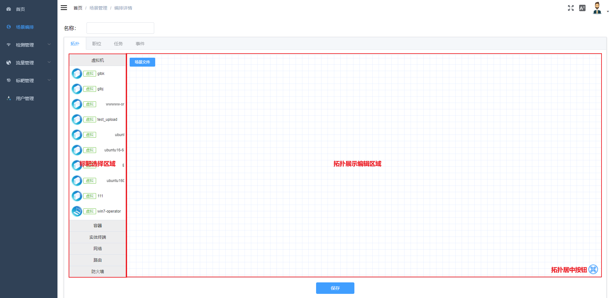

左边为标靶选择面板，右边为拓扑展示编辑面板，其中拓扑居中按钮和场景文件按钮，场景文件是拓扑额外所需的zip包。

## 操作介绍
### 添加节点
  - 从标靶面板拖拽标靶图标至拓扑区域，拓扑区域自动生成与标靶对应的节点，拓扑的右边自动弹出该节点的数据编辑面板。
    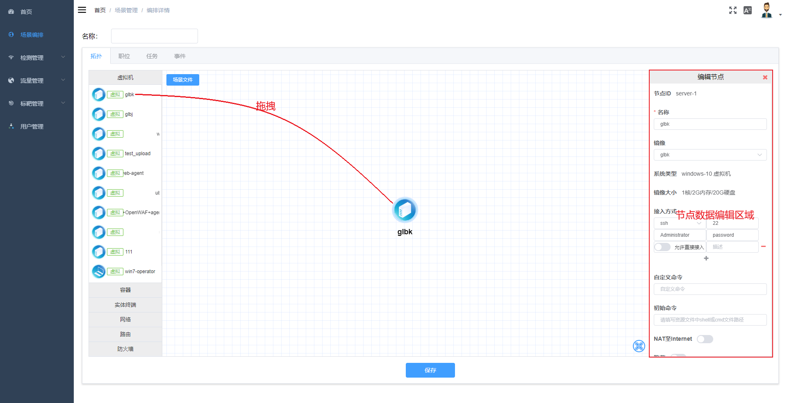

### 编辑节点
  - 点击节点或在节点上右键选择'编辑节点'，节点数据编辑面板会显示出来
    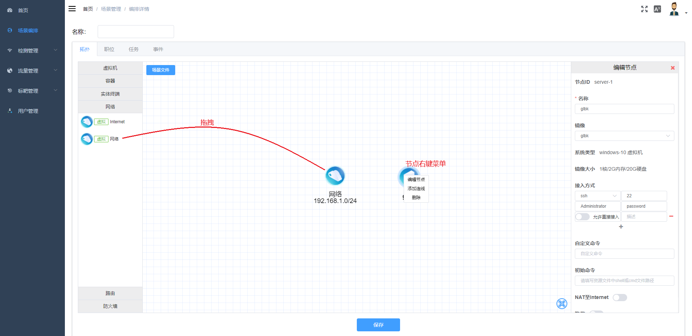

### 删除节点
  - 在节点上右键选择'删除'，删除节点

###  添加连线
  - 在节点上右键选择'添加连线'，节点会进入添加连线的状态（持续5s），
    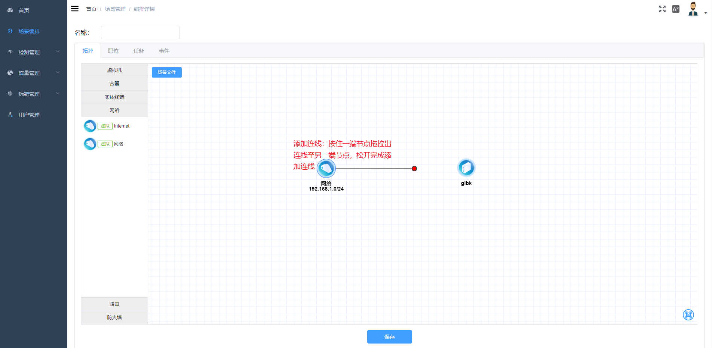
    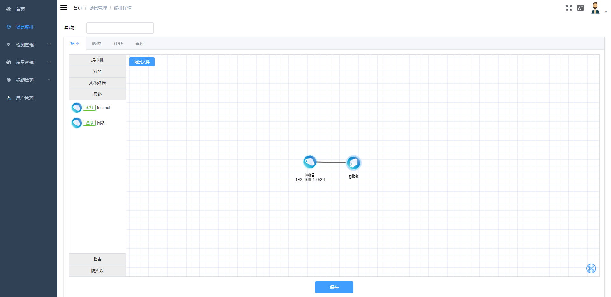

  - 注意
    - 节点无法自己和自己连接
    - 网络节点无法和网络节点连接
    - 网关(路由，防火墙等)节点/终端节点只能和网络连接
    - 节点间只能有一条连线
    - 实体端口设备的连接数无法超过端口数量

###  删除连线
  - 在连线上右键选择'删除'，删除连线

## 节点数据

### 网络

  - 外部网络
    - id以internet开始的网络节点为外部网络（一般从Internet标靶拖拽生成），可修改名称
    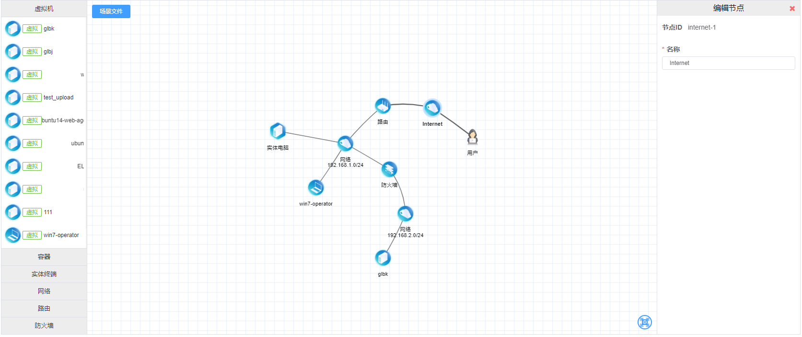
  
  - 普通网络
    - id非internet开始的网络节点为普通默认网络，可编辑名称，地址段，网关，DNS，是否开启DHCP
    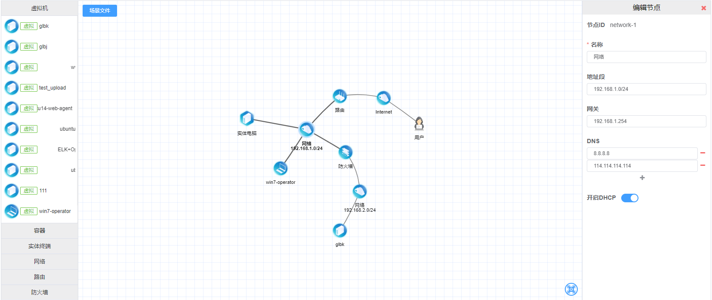

### 网关
  - 路由
    - 路由可编辑名称，静态路由表
    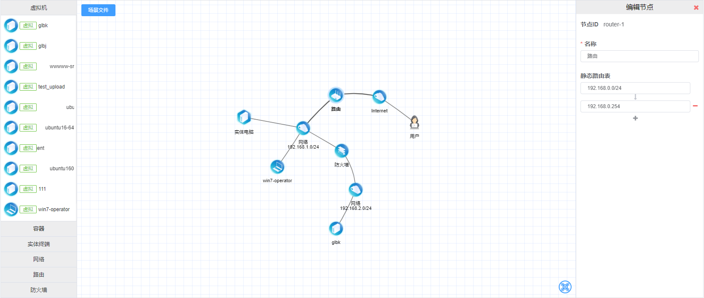
  - 防火墙
    - 路由可编辑名称，静态路由表，防火墙规则
    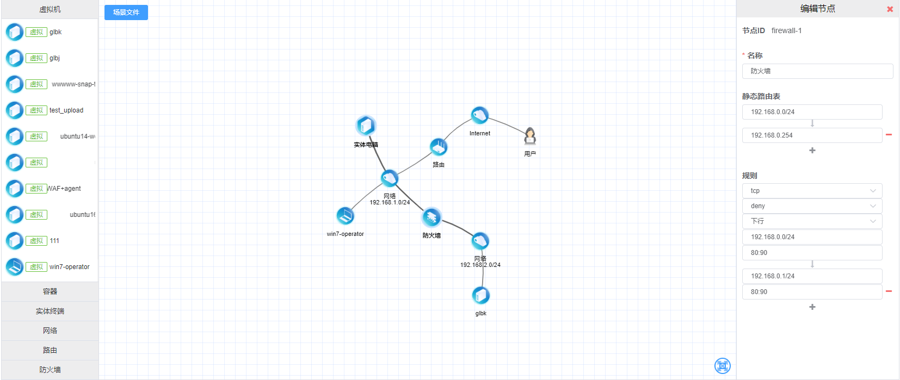

### 终端
  - 虚拟终端
    * 虚拟终端可编辑名称，镜像，接入方式，自定义命令，初始命令，网络配置，是否NAT至Internet
    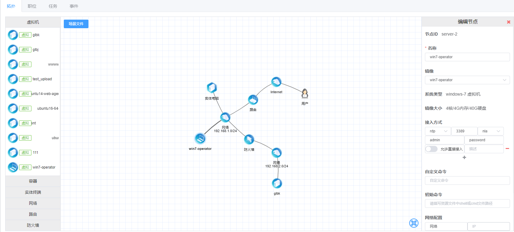

    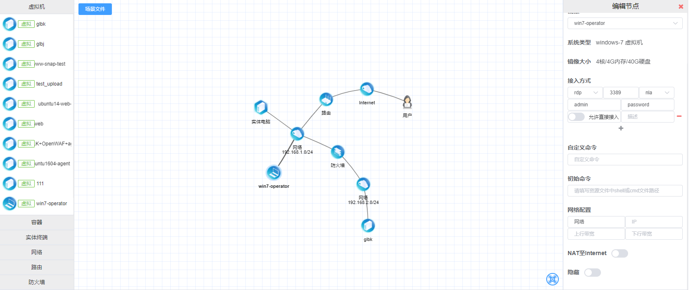

     **注意**

       - 接入方式rdp会有第三个额外选项-认证方式，如果不明确镜像设置，一般情况下win7及以上选择nla, win7以下以及linux选择rdp。
       - 接入方式-允许直接接入选项只有在终端未连接外部网络并未NAT至Internet下才生效
       - 自定义命令与场景文件无关，初始命令与场景文件有关
       - 直连外网的终端不支持配置指定IP
       - NAT至Internet选项只有在终端连接内网并且该内网到外网存在直接路由时才生效

  - 实体终端
    - 实体终端可编辑名称，网络配置
    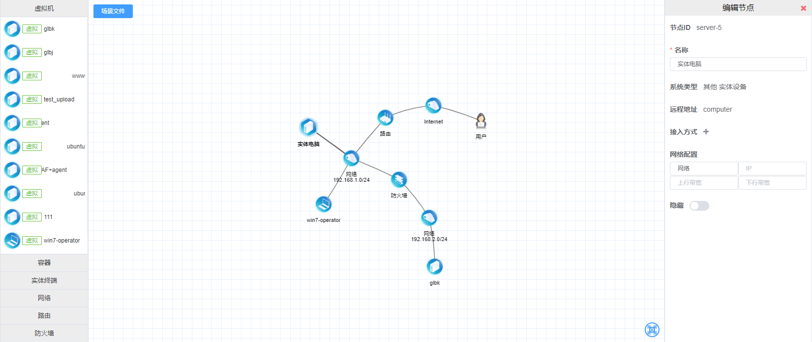
