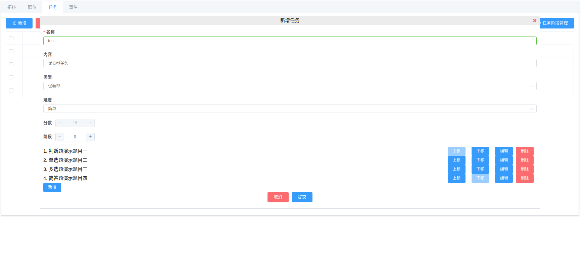
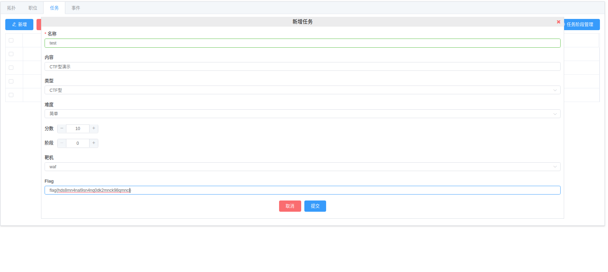
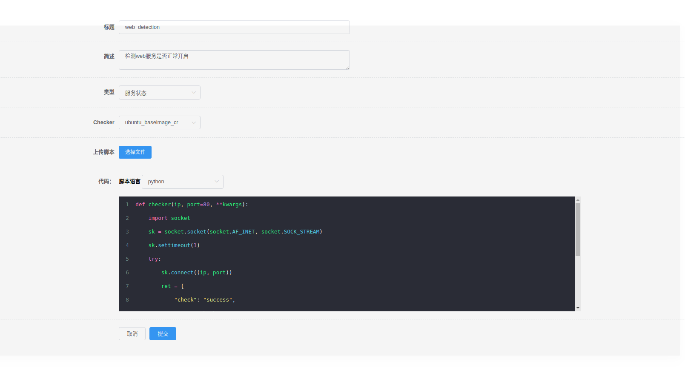
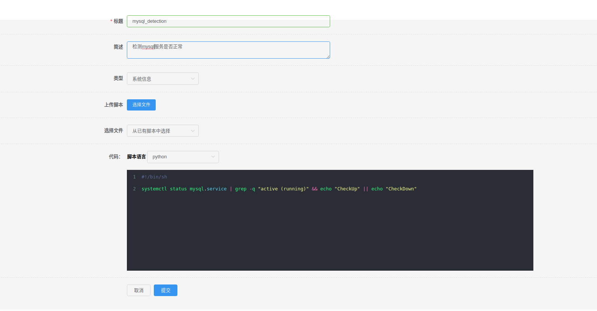
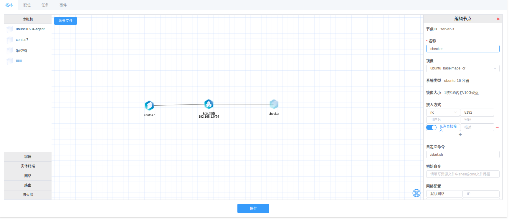
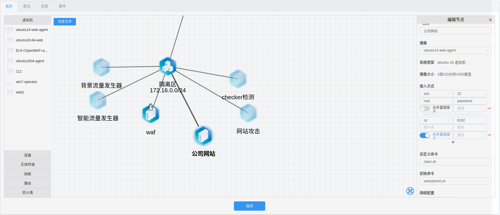

**检测类型**

   - 远程检测
      - 新建远程检测步骤
   - 本地检测
      - 新建本地检测步骤
   - 脚本来源说明
   - 脚本格式
      - python检测脚本格式
      - shell检测脚本格式

----------

# 任务类型

- 试卷型
- CTF型
- 检测型

------

##  试卷型

### 题目类型
  1. 判断题
  2. 单选题
  3. 多选题
  4. 简答题

### 步骤

  1. 点击新增，增加题目
  2. 填写题目（**“内容”为该题目的题干**）
  3. 设置答案



----------


## CTF型

### 步骤

1. 先选择靶机
2. 填写flag




----------

## 检测型

### 检测型类型

  1. 远程检测
  2. 本地检测

### 步骤

1. 选择检测类型（远程检测/本地检测
2. 选择靶机
3. 选择靶机网络
4. 选择检测脚本
5. 填写脚本所需参数（可选）
6. 检测次数（默认为检测一次）
7. 设置首次检测时间（默认为0）
8. 设置检测间隔时间（检测次数为多次时）
9. 设置是否轮询（检测次数为多次时）

**远程检测**



**本地检测**



### 说明

 - 分数：分数可以负分
 - 靶机：靶机为拓扑中添加的机器。
 - 靶机网络： 为所选靶机连接的所有网络。
 - 脚本参数：脚本参数是否需要，传参内容等根据具体脚本而定
 - 传参格式例如：
 
        1、 {"port":80, "time":3}
        2、 port=80, time=3
 
 - 检测次数与轮询，请看 > [任务执行次数以及计分规则](#rule)

### 参数注意事项
   在填写参数的时候，**无需填写ip**，ip默认**作为第一位参数**。ip的值为靶机ip，动态生成。
   - Python传参示例：

        ```python
        def checker(ip, port=80, **kwargs):
            import socket
            sk = socket.socket(socket.AF_INET, socket.SOCK_STREAM)
            sk.settimeout(1)
            try:
                sk.connect((ip, port))
                ret = {
                    "check": "success",
                    "msg": "Check Success"
                }
            except Exception as e:
                ret = {
                    "check": "fail",
                    "msg": str(e)
                }
            return ret
        ```

        正确传参：

        ​    port=90 (因代码中port有默认值，若port=80时，也可以不传。)

        错误传参：

           ip=“xxx.xxx.xx.xx”， port=90  

- shell传参示例：

     ```shell
     ping $1 -c $2 -w 1 | grep -q "ttl=" && echo "CheckUp" || echo "CheckDown"
     ```

     正确传参：

     times=4（**无需传"$1"的参数，前面的“time”在脚本实际运行中无任何意义可自行定义**)

     错误传参：

     ip=“127.0.0.1”，times=4

     **若脚本中不需要靶机ip，则直接使用“$2”作为参数的开始**,例如：

     ```shell
     ping 127.0.0.1 -c $2 -w 1 | grep -q "ttl=" && echo "CheckUp" || echo "CheckDown"
     ```

### 注意事项

- 当检测类型为远程检测时，拓扑中会生成一个**Checker机器**，**请编辑该机器**，在该机器的“自定义命令 ” 中添加命令：** /start.sh**， 并检验“接入方式”中是否有nc,端口是否为8192，若无，则添加**nc接入方式，端口为**8192**

  

- 当检测类型为远程检测时，** 请编辑所选的靶机**，在所选靶机的“自定义命令”中添加命令： **/start.sh**，并检验“接入方式”中是否有nc,端口是否为8192，若无，则添加**nc接入方式，端口为8192**

  


------

## <span id="rule">任务执行次数以及计分规则</span>

  1. "检测一次"(**开启**) —— 只检测一次，失败与否，不再检测，失败不计分，成功计分一次(分数可为负分)
  2. "检测一次"(**关闭**), "是否轮询"(**关闭**) —— 检测多次，直到检测成功，停止检测，计分一次(分数可为负分)
  3. "检测一次"(**关闭**), "是否轮询"(**开启**) —— 检测多次，检测成功一次，计分一次(多次计分)，继续检测，当场景销毁或手动停止任务时停止检测(分数可为负分)
