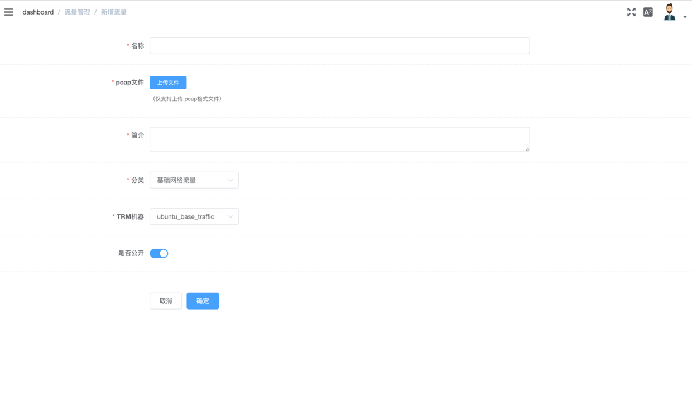
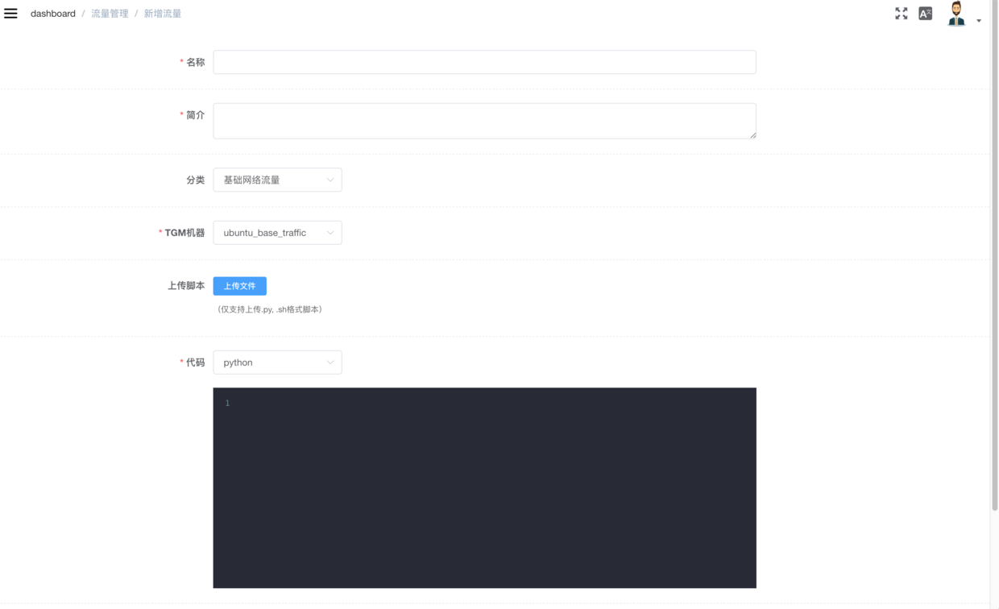

# 流量

- 背景流量
- 智能流量

----------

## 背景流量

系统在TRM上使用Tcpreplay来重放你在网络上捕获的流量或现有的流量包

### 录制流量

  - Wireshark
  - Tcpdump

```shell
tcpdump -i eth0 -w example.pcap -s 0
-i #是指定要抓取的网卡
-w #指定结果保存的位置
```

### TRM准备
前提：ubuntu/centos(docker)，python2， agent-server

待安装：tcpreplay，netifaces

```shell
# 安装tcpreplay
# ubuntu:
apt-get install tcpreplay
# centos:
yum install epel-release
yum install tcpreplay

# 安装netifaces
pip install netifaces
```

### 新增背景流量

1. 在TRM管理中，新建流量重放机器

2. 新增背景流量

   

    **说明：**
    - **只支持上传.pcap后缀的流量包**，选定TRM后完成流量的上传
    - 若无“类型”，请返回列表页面，新建类型

----------

## 智能流量

系统在TGM上执行自定义脚本生成动态流量

### 新增智能流量

1. 在TRM管理中，新建流量发生机器

2. 新增智能流量

   

   脚本可以是python或shell脚本

- python

  python脚本的入口函数名必须为`traffic`，默认参数`ip`是场景实例启动后**目标靶机的ip**，其他参数可以在场景编排时，动态添加。以ping命令产生的流量为例，可以像这样来写一个简单的python流量脚本:

```python
import threading
import subprocess


def execute_command(command):
    process = subprocess.Popen(command, stdin=subprocess.PIPE, stdout=subprocess.PIPE, shell=True)


def traffic(ip=None, **kwargs):
    times = kwargs.get('times') if kwargs.get('times') else '20'
    command = "ping %s -c %s" % (ip, str(times))
    execute_command(command)
    return command
```

- shell

shell脚本的第一个参数默认为场景实例启动后**目标靶机的ip**，其他参数可以在场景编排时，动态添加。以ping命令产生的流量为例，可以像这样来写一个简单的shell流量脚本:

```shell
	ping $1 -c 100
```

选定TGM，完成智能流添加
