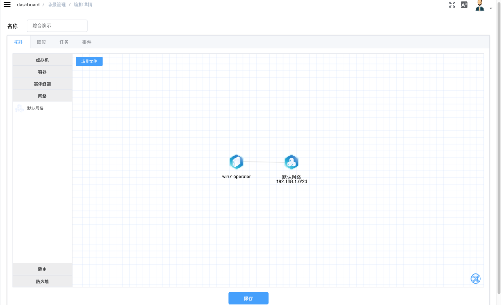
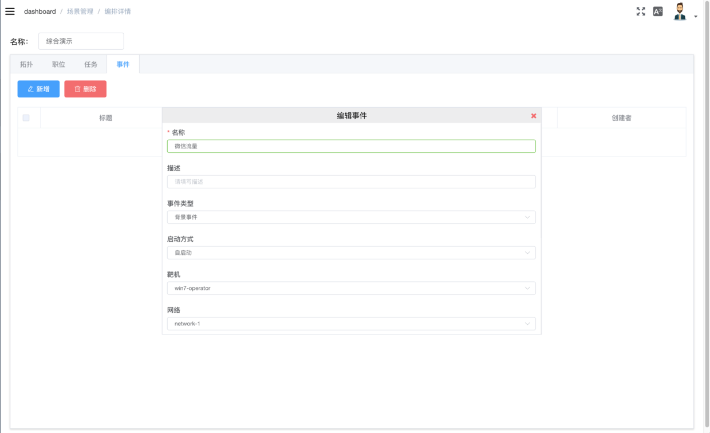
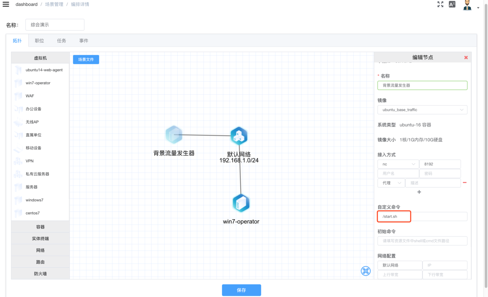

# 流量事件

- 背景事件
- 智能事件

----------

### <font color=#FF3333>**前置要求：**</font>

- 拓扑中存在靶机
- 靶机已配置网络




### 添加流量事件



<strong size="4">事件类型 </strong>
事件分为**背景事件/智能事件**两种类型

- **背景事件**即场景实例启动时同时启动TRM向目标靶机持续发送背景流量
- **智能事件**即场景实例启动时同时启动TGM向目标靶机持续发送智能流量

<strong size="4">启动方式 </strong>
启动方式分为**自启动/延迟启动**两种类型

- **自启动**即随场景实例启动时启动流量发生器发送流量
- **延迟启动**即随场景实例启动后延时启动流量发生器发送流量，在设定时间开始之前可手动启动该事件

<strong size="4">靶机 </strong>
选择流量事件的目标靶机

<strong size="4">网络 </strong>
选择目标靶机所在的网络

<strong size="4">流量类型 </strong>
选择流量的类型

<strong size="4">流量</strong>
选择流量

<strong size="4">参数</strong>
支持动态参数即需要动态变化的参数。用`=`赋值，多个参数用`,`号隔开：

```
times=10, delay=10
```

<strong size=4>注意：</strong>

- 添加完流量事件后，需返回至拓扑页面再次保存
- TGM/TRM需配置启动命令

```
/start.sh
```



- TGM/TRM在靶场前台不予显示
